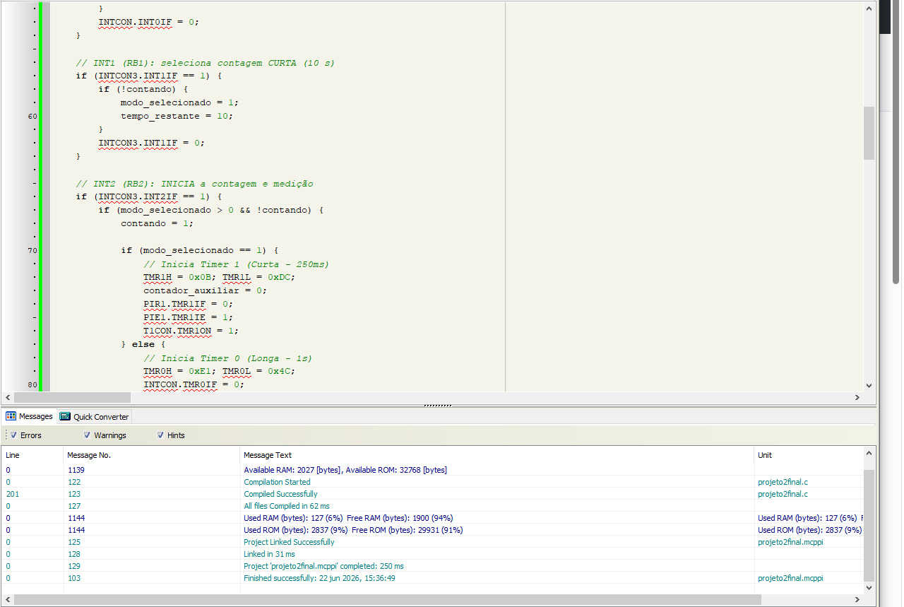
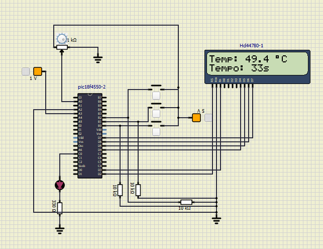

# SEL0433 – Projeto 2: Aferidor de Temperatura de Forno Industrial

**Disciplina:** SEL0433 – Aplicação de Microprocessadores  
**Universidade de São Paulo (USP)**

**Integrantes:**
| Nome | Nº USP |
|---|---|
| Lucas Manoel Freitas da Silva | 15471884 |
| Gabriel Suerdieck Nardelli | 15453960 |
| Ulisses Lombardi Campos | 14781443 |

---

## Introdução

Esse projeto foi desenvolvido para a disciplina SEL0433 e tem como objetivo medir a temperatura interna de um forno industrial durante um intervalo de tempo escolhido pelo usuário. Para isso, utilizamos o microcontrolador PIC18F4550, um display LCD 16x2, um potenciômetro simulando o sensor LM35, três botões com interrupção externa e um LED indicador.

A implementação foi feita no MikroC PRO for PIC e simulada no SimulIDE.

---

## Como funciona

O usuário escolhe entre dois modos antes de iniciar:

- **Botão RB0 (INT0):** seleciona medição longa — 60 segundos
- **Botão RB1 (INT1):** seleciona medição curta — 10 segundos
- **Botão RB2 (INT2):** inicia a contagem e a leitura de temperatura

Enquanto a contagem está ativa, o LCD mostra a temperatura lida e o tempo restante. Quando o tempo chega a zero, aparece a mensagem "Fim da medicao!" e tudo é desligado.

O LED conectado ao RC0 funciona como indicador da resistência do forno: acende quando a temperatura está abaixo de 60 °C e apaga quando passa de 80 °C. Essa faixa de histerese evita que o LED fique piscando quando a temperatura está na borda dos limiares.

---

## Leitura de temperatura

A temperatura é lida pelo ADC de 10 bits do PIC, com referência externa de 1 V nos pinos RA2 e RA3. Usamos 1 V de referência porque se adequa melhor à sensibilidade do LM35 (10 mV por grau Celsius), evitando perda de resolução.

A conversão é feita com aritmética inteira para não usar float, que ocupa muita memória:

```
temp_x10 = (leitura_adc * 1000) / 1023
```

O resultado representa a temperatura multiplicada por 10, permitindo mostrar uma casa decimal no formato `XX.X °C` sem operações em ponto flutuante.

---

## Timers e contagem de tempo

Usamos dois timers diferentes dependendo do modo escolhido:

- **TMR0** com prescaler 256 gera uma interrupção a cada ~1 segundo (modo longo)
- **TMR1** com prescaler 8 gera uma interrupção a cada ~250 ms; um contador auxiliar acumula 4 interrupções para decrementar 1 segundo (modo curto)

Os valores de recarga foram calculados para um clock de 8 MHz:

```
TMR0: 0xE1:0x4C  (~1 segundo)
TMR1: 0x0B:0xDC  (~250 ms)
```

---

## Pinagem utilizada

| Pino | Função |
|---|---|
| RA0 | Entrada analógica (potenciômetro) |
| RA2 | Vref+ externo (1 V) |
| RB0 | Botão modo longo (INT0) |
| RB1 | Botão modo curto (INT1) |
| RB2 | Botão iniciar (INT2) |
| RC0 | LED da resistência |
| RD2–RD7 | LCD (RS, EN, D4–D7) |

---

## Compilação



A compilação foi feita sem erros no MikroC PRO for PIC. O projeto ocupou 2837 bytes de ROM (9%) e 127 bytes de RAM (6%) do PIC18F4550.

---

## Simulação



Na imagem acima, o sistema está em funcionamento no SimulIDE com o potenciômetro ajustado para cerca de 49,4 °C e 33 segundos restantes no modo longo.

---

## Discussão dos resultados

O projeto funcionou conforme o esperado na simulação. A leitura de temperatura ficou estável e dentro da faixa de 0 a 100 °C. A escolha de usar 1 V como referência do ADC foi essencial para aproveitar melhor a resolução do conversor com o LM35.

A histerese no controle do LED funcionou bem para evitar chaveamentos desnecessários em temperaturas próximas aos limiares. Os timers geraram bases de tempo precisas para ambos os modos e as interrupções dos botões responderam corretamente, sem acionamentos acidentais durante a contagem.

O uso de memória ficou bem abaixo do limite do PIC18F4550, o que mostra que o código está enxuto e eficiente.

---

## Arquivos do repositório

| Arquivo | Descrição |
|---|---|
| `projeto2final.c` | Código-fonte em C |
| `projeto2final.hex` | Arquivo compilado |
| `projetofinal2.simu` | Simulação no SimulIDE |
| `compilacao.png` | Print da compilação |
| `simulacao.png` | Print da simulação em execução |

---

## Como rodar a simulação

1. Baixe e instale o [SimulIDE](https://simulide.com/p/downloads/)
2. Abra o arquivo `projetofinal2.simu`
3. Clique em Play
4. Gire o potenciômetro para mudar a temperatura
5. Use os botões para selecionar o modo e iniciar

---

*Projeto desenvolvido para SEL0433 – Aplicação de Microprocessadores, EESC/USP.*
